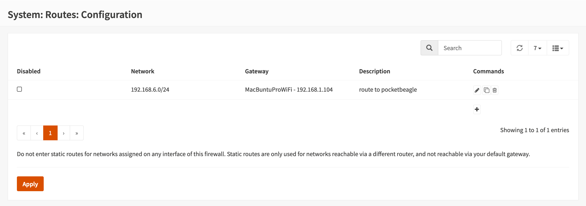

# Experiments With the PocketBeagle

The pocketbeagle is yet another small device capable of running Linux. The hardware is based on ARM technology. It was designed by Texas Instruments, who placed the hardware design in open source. The PocketBeagle is manufactured by one of several manufacturing partners to the [BeagleBoard.org Foundation](https://beagleboard.org/about). PocketBeagle is the smallest (and cheapest) of several similar devices including BeagleBone, Beagle Bone, Black, etc, etc.  

I have become interested in PocketBeagle as an alternative to the Raspberry Pi - specifically in terms of its reduced power consumption, direct analog input and open source hardware documentation. It remains to be seen whether or not the PocketBeagle can be placed in a low-power sleep mode suitable for long-term battery-powered operation. Communication is another open question: as sold and shipped, the PocketBeagle has only a single USB port that serves both power and communication. However, PocketBeagle has several interfaces - GPIO, analog I/O, and auxiliary hardware boards are also available. Other members of the "Beagle Family" include Bluetooth, WiFi, etc - testament to the processor's ability to support comms.

## Baby Steps

First order of business is to power up the PocketBeagle, and make a connection. I will try this first with a Linux laptop, and then with a Raspberry Pi. The documentation states that the PocketBeagle communicates with the *outside world* over TCP/IP connections - HTTP and SSH for example. Which raises my first question: "*How does that work - this [Ethernet over USB](https://community.st.com/s/question/0D50X00009XkZ0GSAV/ethernet-over-usb)?*"  ([*See also Wikipedia re Ethernet-over-USB*](https://en.wikipedia.org/wiki/Ethernet_over_USB)) 

The Wikipedia article is informative. It contains at least two *revelations*: 

1. Ethernet over USB is now **transparent** to applications
2. Ethernet over USB technology is **20 years old** - maybe before you heard of Ethernet or USB?! 

> The USB-eth module in Linux makes the computer running it a variation of an Ethernet device that uses USB as the physical medium. It creates a Linux network interface, which can be assigned an IP address and  otherwise treated the same as a true Ethernet interface.  ***Any  applications that work over real Ethernet interfaces will work over a  USB-eth interface without modification, because they can't tell that  they aren't using real Ethernet hardware***.[REF](https://www.embedded.com/linux-based-usb-devices/)  *(emphasis mine)* 
>
> On Linux hosts, the corresponding Ethernet-over-USB kernel module is called usbnet. The Bahia Network Driveris a usbnet-style driver available for Win32 hosts. 

### Network setup & preliminaries:

PocketBeagle boots from a microSD card. The [*Getting Started Guide*](http://beagleboard.org/getting-started) provides most of the required information. Download the latest image, flash it to the microSD, insert the card, connect the PocketBeagle to a USB port to power up. 

### Linux laptop connectivity:

PocketBeagle shown connected to Linux laptop [`MacBuntuPro`](https://github.com/seamusdemora/seamusdemora.github.io/blob/master/LinuxOnLate2011.md) - a dual-boot late-2011 Macbook Pro:

 

#### Plug PocketBeagle into a USB port:

I'll use an Ubuntu Linux system to host PocketBeagle. I call this machine MacBuntuPro to indicate its mixed heritage: a 2011 Macbook Pro running Ubuntu 20.04. Open Macbuntu's lid, login, open a terminal window, and plug PocketBeagle into an open USB port. Let's see what happened: ​ 

#### run `ifconfig`on MacBuntu:

`ifconfig` (or [equivalently `ip a`](https://www.tecmint.com/ifconfig-vs-ip-command-comparing-network-configuration/)) reveals that connecting the PocketBeagle has added two (2) new interfaces on MacBuntu.


```bash
seamus@MacBuntuPro:~$ ifconfig 
enx606405fa813b: flags=4163<UP,BROADCAST,RUNNING,MULTICAST>  mtu 1500
        inet 192.168.7.1  netmask 255.255.255.0  broadcast 192.168.7.255
        inet6 fe80::2267:92a0:a191:297d  prefixlen 64  scopeid 0x20<link>
        ether 60:64:05:fa:81:3b  txqueuelen 1000  (Ethernet)
        ...

enx606405fa813d: flags=4163<UP,BROADCAST,RUNNING,MULTICAST>  mtu 1500
        inet 192.168.6.1  netmask 255.255.255.0  broadcast 192.168.6.255
        inet6 fe80::3898:bc86:d0c2:cb53  prefixlen 64  scopeid 0x20<link>
        ether 60:64:05:fa:81:3d  txqueuelen 1000  (Ethernet)
        ...
# trimmed for brevity        
```

#### connect to *"pocketbeagle"* via `ssh` & check `ifconfig`: 

Let's see what connections are available on the PocketBeagle. 

```bash
seamus@MacBuntuPro:~$ ssh debian@192.168.1.2
...
debian@beaglebone:~$ ifconfig
usb0: flags=4163<UP,BROADCAST,RUNNING,MULTICAST>  mtu 1500
        inet 192.168.7.2  netmask 255.255.255.0  broadcast 192.168.7.255
        inet6 fe80::6264:5ff:fefa:813a  prefixlen 64  scopeid 0x20<link>
        ether 60:64:05:fa:81:3a  txqueuelen 1000  (Ethernet)
        ...
usb1: flags=4163<UP,BROADCAST,RUNNING,MULTICAST>  mtu 1500
        inet 192.168.6.2  netmask 255.255.255.0  broadcast 192.168.6.255
        inet6 fe80::6264:5ff:fefa:813e  prefixlen 64  scopeid 0x20<link>
        ether 60:64:05:fa:81:3e  txqueuelen 1000  (Ethernet)
        ...
```


### Connect PocketBeagle to the Internet

At this point, we can make connections between PocketBeagle and the MacBuntu host that it is plugged into. Additional network configuration is required to go beyond that.

#### check and adjust routing configuration on the PocketBeagle as necessary:

Where does PocketBeagle send its packets?

```bash
debian@beaglebone:~$ route -n
Kernel IP routing table
Destination     Gateway         Genmask         Flags Metric Ref    Use Iface
192.168.6.0     0.0.0.0         255.255.255.0   U     0      0        0 usb1
192.168.7.0     0.0.0.0         255.255.255.0   U     0      0        0 usb0
```

That will carry the traffic one hop - to the "new" interfaces created on MacBuntu. We want to go well beyond that - to gain Internet connectivity, and so we'll start here to change that by adding a *default gateway* for PocketBeagle's networks:

```bash
debian@beaglebone:~$ sudo route add default gw 192.168.6.1
# verify route addition:
debian@beaglebone:~$ route -n
Kernel IP routing table
Destination     Gateway         Genmask         Flags Metric Ref    Use Iface
0.0.0.0         192.168.6.1     0.0.0.0         UG    0      0        0 usb1
192.168.6.0     0.0.0.0         255.255.255.0   U     0      0        0 usb1
192.168.7.0     0.0.0.0         255.255.255.0   U     0      0        0 usb0
```

We could add one for the `192.168.7.0/24` network also, but let's forego that for now as it may be unnecessary.

#### share *"MacBuntu"* WiFi with *"PocketBeagle"*:

Two settings are required on the MacBuntu host to enable this - Forwarding, and a Gateway: 

1. **Forwarding:** Enable forwarding (or check that it is already enabled) & verify the firewall is inactive: 

```bash
seamus@MacBuntuPro:~$ cat /proc/sys/net/ipv4/ip_forward
1
# forwarding was enabled on MacBuntu in /etc/sysctl.conf with `net.ipv4.ip_forward=1`

seamus@MacBuntuPro:~$ sudo ufw status
Status: inactive 
# firewall is inactive -> no packet filtering - this is what we want for now

```

2. **A Gateway:** On this network (my network) the packets sourced from PocketBeagle should go to the same place as the other traffic from `192.168.1.0/24`. Let's inspect the routing table for MacBuntu:

```bash
seamus@MacBuntuPro:~$ route -n
Kernel IP routing table
Destination     Gateway         Genmask         Flags Metric Ref    Use Iface
0.0.0.0         192.168.1.1     0.0.0.0         UG    600    0        0 wlp3s0
192.168.1.0     0.0.0.0         255.255.255.0   U     600    0        0 wlp3s0
192.168.6.0     0.0.0.0         255.255.255.0   U     101    0        0 enx606405fa813d
192.168.7.0     0.0.0.0         255.255.255.0   U     100    0        0 enx606405fa813b
```

The needed gateway at `192.168.1.1` already exists because MacBuntu is already using that network. With the configuration changes made so far, packets sourced by the PocketBeagle are reaching the LAN gateway/firewall. However, they don't yet have a route to get back! That change will be made on the LAN gateway/firewall. 

#### create a return route to the *"PocketBeagle"* from the LAN gateway/firewall:

This will be done by adding a static route; the route will conduct packets from the LAN gateway at 192.168.1.1 to the WiFi adapter on MacBuntu - which is the "gateway" to reach the network 192.168.6.0/24. As the LAN gateway/firewall is a dual-NIC host running the OPNsense firewall distribution, the static route will be added using the OPNsense GUI. This must be done in two steps due to the protocol built into the OPNsense GUI: 

1. add a gateway at 192.168.1.104 for 192.168.1.1 (**`LANem1`**) 

   * Navigate to: **`System: Gateways: Single`** page in GUI; select **`Add`** button in upper right corner

   * Create the gateway in the GUI: for example: 

      ​      

   * Save & apply; verify the gateway is added:

      ​      

1. add a static route from 192.168.1.1 to the MacBuntu WiFi serving as the gateway to PocketBeagle:

   * Navigate to: **`System: Routes: Configuration`** page in the GUI; select **`+`** symbol in vacant line
   
   * Add the necessary information in the route creation panel, then Save & Apply: 
   
      
   
   * Verify the static route has been added:       
   


#### add NAT rule for network 192.168.6.0/24

At this point, the PocketBeagle can connect and `ping` the LAN gateway at 192.168.1.1. However, it does not yet have Internet access. This is because there is no NAT rule for packets whose source address is in the 192.168.6.0/24 network. This final step is not obviously necessary, but it's straightforward to add to the OPNsense GUI. 

   * Navigate to: **`Firewall: NAT: Outbound`**, and change the `Mode` to the `Hybrid` option as shown:   

   * Click the `Add` button in upper right to add new `manual` NAT rule; complete the form, Apply & Save:   

   * Verify the manual NAT rule has been added, edit if required:    

#### PocketBeagle now has access to Internet

The PocketBeagle should now be able to access the Internet. Verify this by running `sudo apt update`. Running a `traceroute` may also be useful or informative for verification or to troubleshoot issues. 

### Connect to *"pocketbeagle"* from hosts on LAN using `ssh`:

With `forwarding` enabled on the Ubuntu host, and after adding a default route on *pocketbeagle*, one quick and relatively easy way to connect from any host on the `192.168.1.0` LAN is to add a route on each individual host. On macOS, this is done with a command that's a [bit different](https://blog.tinned-software.net/show-network-routes-on-macosx/) from the syntax used in Linux: 

```zsh
% sudo route -n add 192.168.6.0/24 192.168.1.104
Password:
add net 192.168.6.0: gateway 192.168.1.104

# let's test that:

% ssh debian@192.168.6.2
Debian GNU/Linux 10
BeagleBoard.org Debian Buster IoT Image 2020-04-06
...
debian@192.168.6.2's password: 
...
debian@beaglebone:~$

# Sucess!
```


### Conclusion of Network setup & preliminaries :

We have concluded the required configuration changes to integrate the PocketBeagle with the LAN, and provide Internet access. At this point, while PocketBeagle remains on its own subnet, it is fully connected. Having network connectivity allows use of Debian's [*Advanced Package Tool*](https://wiki.debian.org/AptCLI)  `apt`  to manage software on  *pocketbeagle*: 

```bash
debian@beaglebone:~$ sudo apt-get update
...		# this will take some time ...
Fetched 2,005 kB in 1min 34s (21.3 kB/s)                                                                                    
Reading package lists... Done

debian@beaglebone:~$ sudo apt-get upgrade
...
The following packages have been kept back:
  c9-core-installer libnode-dev libnode64 nodejs
The following packages will be upgraded:
  bb-cape-overlays bb-customizations bb-node-red-installer bb-wl18xx-firmware libjson-c3 ti-pru-cgt-installer
6 upgraded, 0 newly installed, 0 to remove and 4 not upgraded.
Need to get 42.6 MB of archives.
After this operation, 133 MB of additional disk space will be used.
Do you want to continue? [Y/n] Y 

...		# again, this will take some time ... 

debian@beaglebone:~$

# It's often a good idea to reboot the system after an upgrade 
# To avoid manually creating the default gateway entry, 
# Place that in a script to be executed by `cron` @reboot.
# Use root's crontab for this as adding a route requires su privileges;
# i.e. `sudo route add default gw 192.168.6.1`

debian@beaglebone:~$ sudo crontab -e

# Use the editor to add this line:

@reboot (sleep 20; /home/debian/share-net.sh) >> /home/debian/cronlog 2>&1

# I use a sript file instead of the route command directly, tho' either will work
# Save & exit the editor
# Reopen the editor to create ~/share-net.sh
# Add the following: 

#!/bin/bash
# option 1: add static routes:
/sbin/route add -net 0.0.0.0 gw 192.168.6.1
# /sbin/route add -net 0.0.0.0 gw 192.168.7.1
# /sbin/dhclient -r usb1 # name resolution?

# Save & exit the editor

debian@beaglebone:~$ chmod 755 ~/share-net.sh
debian@beaglebone:~$ sudo reboot

```


## Hello World with Blinky Lights

Browsing the API documentation at http://192.168.6.2/ide.html, the file `blinkLED.c` suggests itself as a place to begin. Reviewing the C source leads to this `bash` script: 

```bash
#!/bin/bash
# Flash light using an infinite while loop; hit [CTRL+C] to stop!

LEDFILE=/sys/devices/platform/leds/leds/beaglebone:green:usr3/brightness

while :
do
   echo "1" > $LEDFILE
   sleep 0.25
   echo "0" > $LEDFILE
   sleep 0.25
done
```

Which duly flashes the `usr3` LED on & off until the program is halted.


---

<!--- 

### GUI & `nmcli` alternative approach


1. On beaglebone host: Add a default gateway route to pocketbeagle:

```bash
$ sudo route add default gw 192.168.6.1

# verify route addition:

debian@beaglebone:~$ route -n
Kernel IP routing table
Destination     Gateway         Genmask         Flags Metric Ref    Use Iface
0.0.0.0         192.168.6.1     0.0.0.0         UG    0      0        0 usb1
192.168.6.0     0.0.0.0         255.255.255.0   U     0      0        0 usb1
192.168.7.0     0.0.0.0         255.255.255.0   U     0      0        0 usb0

```


### Raspberry Pi connectivity:

Using an old RPi 1BP model running `buster`: With the PocketBeagle plugged into one of the RPi's USB ports, `ifconfig` shows a different picture than it did on the Linux laptop. Note the MAC addresses shown by the RPi are the same as with the Linux laptop, but they are assigned the same IP address as the native `eth0` used for networking this RPi.

Given that the PocketBeagle's MAC addresses appear in this list, it should be possible to route/transfer packets to them, and *initiate* a connection to the PocketBeagle from another host on the network. ***How?*** becomes the operative question! 


```bash
pi@raspberrypi1bp:~ $ ifconfig
eth0: flags=4163<UP,BROADCAST,RUNNING,MULTICAST>  mtu 1500
        inet 192.168.1.179  netmask 255.255.255.0  broadcast 192.168.1.255
        inet6 2605:a601:a82a:e600::1bfa  prefixlen 128  scopeid 0x0<global>
        inet6 fe80::522e:669e:c4ee:3aaa  prefixlen 64  scopeid 0x20<link>
        ether b8:27:eb:3a:b9:78  txqueuelen 1000  (Ethernet)
        RX packets 6343845  bytes 808844488 (771.3 MiB)
        RX errors 0  dropped 0  overruns 0  frame 0
        TX packets 124862  bytes 14526766 (13.8 MiB)
        TX errors 0  dropped 0 overruns 0  carrier 0  collisions 0

eth1: flags=4163<UP,BROADCAST,RUNNING,MULTICAST>  mtu 1500
        inet 192.168.1.179  netmask 255.255.255.0  broadcast 192.168.1.255
        inet6 fe80::82b9:1242:f782:cf5b  prefixlen 64  scopeid 0x20<link>
        ether 60:64:05:fa:81:3d  txqueuelen 1000  (Ethernet)
        RX packets 1355  bytes 42333 (41.3 KiB)
        RX errors 0  dropped 0  overruns 0  frame 0
        TX packets 64  bytes 17947 (17.5 KiB)
        TX errors 0  dropped 0 overruns 0  carrier 0  collisions 0

eth2: flags=4163<UP,BROADCAST,RUNNING,MULTICAST>  mtu 1500
        inet 192.168.1.179  netmask 255.255.255.0  broadcast 192.168.1.255
        inet6 fe80::de2c:afba:63a4:d3bb  prefixlen 64  scopeid 0x20<link>
        ether 60:64:05:fa:81:3b  txqueuelen 1000  (Ethernet)
        RX packets 41  bytes 6226 (6.0 KiB)
        RX errors 0  dropped 0  overruns 0  frame 0
        TX packets 61  bytes 20337 (19.8 KiB)
        TX errors 0  dropped 0 overruns 0  carrier 0  collisions 0

lo: flags=73<UP,LOOPBACK,RUNNING>  mtu 65536
        inet 127.0.0.1  netmask 255.0.0.0
        inet6 ::1  prefixlen 128  scopeid 0x10<host>
        loop  txqueuelen 1000  (Local Loopback)
        RX packets 0  bytes 0 (0.0 B)
        RX errors 0  dropped 0  overruns 0  frame 0
        TX packets 0  bytes 0 (0.0 B)
        TX errors 0  dropped 0 overruns 0  carrier 0  collisions 0
```


--->